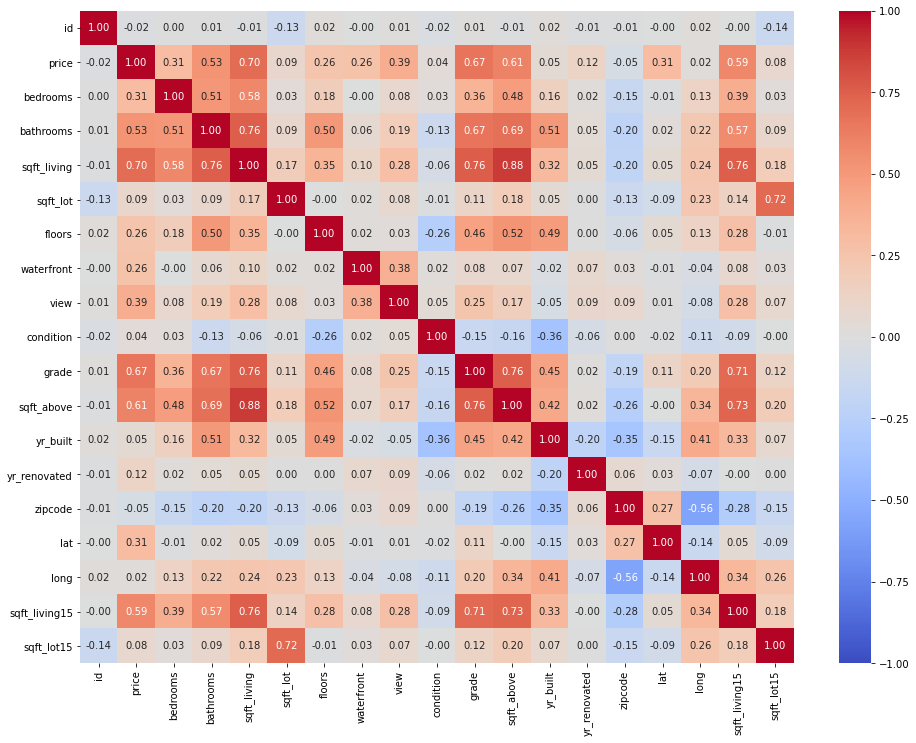

# Predicting House Prices in King County: Evaluating the Impact of Home Features and Renovations using Comprehensive Analysis of multiple linear regression.
## INTRODUCTION
The real estate market in King County is dynamic and competitive, with various factors influencing property values. Homeowners and real estate agencies are particularly interested in understanding how different features of a house, as well as renovations, can impact its market value. Accurate and data-driven insights into these factors can significantly enhance decision-making processes for buying, selling, and renovating homes.

## KEY OBJECTIVES
### 1. Create a Home Price Predictive Model:
Build and improve a regression model to precisely forecast King County real estate values depending on a range of property characteristics and remodeling factors. Make that the model is reliable, strong, and has high predicted accuracy.

### 2. List the Main Factors Affecting Home Prices:
Determine which characteristics—such as location, number of bedrooms, and square footage—have the most effects on home pricing by analyzing the dataset. Analyze the impact of particular improvements on home values, such as kitchen remodels and bathroom additions.

### 3. Give Homeowners Useful Information:
Utilize the model's output to provide homeowners with useful guidance on how to increase the market value of their property through well-chosen upgrades. Determine which upgrades are most cost-effective and provide the best return on investment.

### 4. Facilitate Decision-Making in Real Estate Agencies:
Provide the real estate company with data-driven insights so that it may provide clients with more informed purchasing and selling advice. Boost the agency's capacity to advise customers on the types of home upgrades that will most likely raise their property's worth.

## OUTLINE
<ul>
<li> Data analysis and cleaning: Outliers and missing values were handled as the King County House Sales dataset was loaded and cleaned.</li>
<li> Exploratory Data Analysis (EDA): Investigated the connections between attributes and prices and produced a visual representation of the distribution of home prices.</li>
<li> Determined the essential characteristics most closely correlated with home values. </li>
<li> Model Development: Three linear regression models were constructed and assessed. </li>
<li> Model Evaluation: R-squared (R²) and Mean Absolute Error (MAE) were used to evaluate the performance of the model. </li>
<li> Suggestions: Gave homeowners and real estate agents practical advice on how to increase house values by emphasizing living space optimization and quality enhancements.
</ul>

## DATA ANALYSIS
We will be using using data from the file kc_house_data.csv which contains the prices of houses in King County alongside their features such as year built, year renovated, number of bedrooms and bathrooms, and many more. The full listing of columns and descriptive statistics of the data is shown below.

An R-squared value of 0.6515 means that approximately 65.15% of the variance in the dependent variable  is explained by the independent variables included in the regression model. This indicates a moderately strong relationship between the predictors and the target variable. However, it also suggests that there is room for improvement, as a significant portion of the variance remains unexplained

The heat map will visually show the strength and direction of the correlation between each pair of features:
High Positive Correlation (close to 1): Indicates that as one feature increases, the other feature tends to increase as well.
High Negative Correlation (close to -1): Indicates that as one feature increases, the other feature tends to decrease.
Low Correlation (close to 0): Indicates little to no linear relationship between the features.

By including the target variable price, you can observe how each feature relates to the house prices.
Scatter plots involving price can highlight which features have strong linear or non-linear correlations with the target variable. 

## RECOMMENDATIONS 
❖ Estimating the Impact of Specific Renovation Projects: The agency can use the Third Model to provide homeowners with estimates of how specific renovation projects will impact the resale value of their homes. Homeowners can make informed decisions about which renovation projects to prioritize, based on their expected return on investment (ROI). This will empower homeowners to invest in renovations that will maximize their property's resale value.

❖ Identifying Renovation Projects with the Most Impact: Amani can utilize the third model to identify which specific renovation projects or features have the most significant impact on a home's market value in the northwestern count 

❖Correlation of Bedrooms, Bathrooms, Grade, and Square Footage with Sale Price: They can leverage the third model to explain how the number of bedrooms, bathrooms, the grade of a house, and its square footage correlate with its sale price in King County. They can utilize the model's coefficients and feature importance analysis to explain the correlations between these variables and sale price. 

❖ Identifying Combinations of Renovation Projects: The third model will help identify specific combinations of renovation projects that provide an interdependent effect on a home's market value. 

## SUMMARY/Conclusion
 In summary, the project study suggests that the number of bedrooms, square footage of living area, condition, number of bedrooms, bathrooms and floors are important factors to consider when determining the price of a home. However, it is essential to consider other market factors and property-specific attributes in conjunction with the findings of this analysis to arrive at an accurate and competitive listing price such as architectural style, lot size and landscaping, upgrades and amenities, historical sales data, market trends, school district, crime rate, zoning and regulations. 
